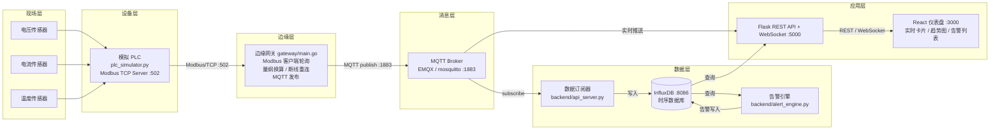
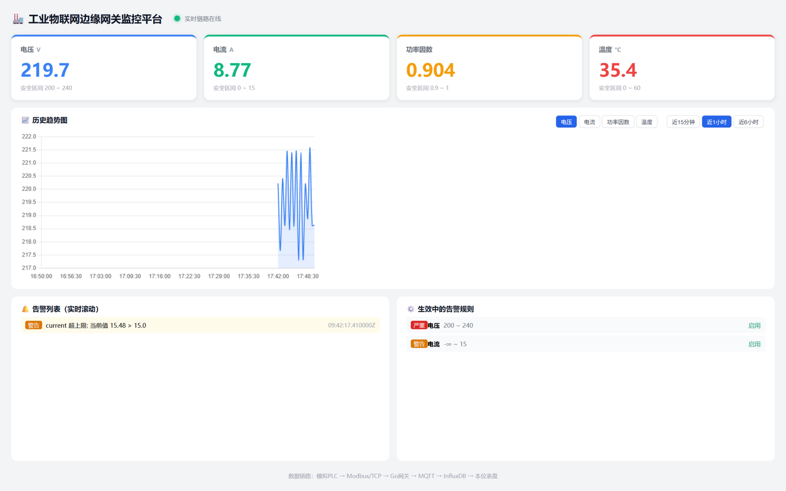
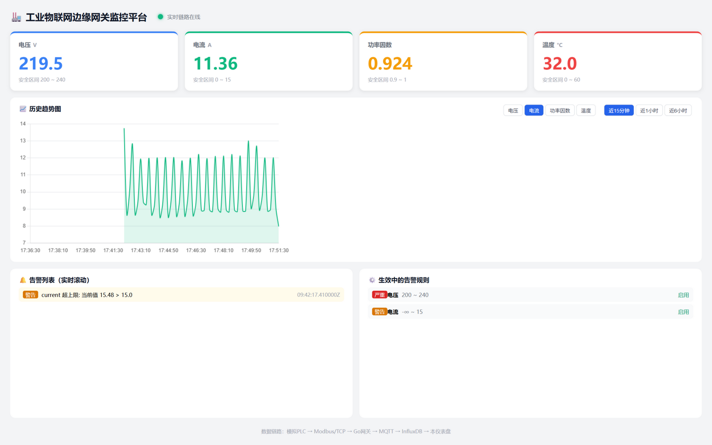

# Industrial-IoT-Edge-Gateway-System

[](https://github.com/lwj15089590118/Industrial-IoT-Edge-Gateway-System/actions/workflows/ci.yml)


[](LICENSE)

工业物联网边缘网关系统 —— 一个模拟工厂数据采集与边缘计算的全栈项目。

## 项目简介

本项目实现了一套完整的工业物联网（IIoT）数据采集链路：由 Python 模拟 PLC 持续生成电压、电流、功率因数、温度等工业量测数据，Go 编写的边缘网关通过 **Modbus/TCP** 协议按点表批量读取保持寄存器（连续地址单事务）并进行量纲换算，以 **MQTT** 协议上传至消息总线；订阅端将数据落地 **InfluxDB** 时序数据库，Flask 后端提供 REST API 与 WebSocket 实时推送，告警引擎周期性执行阈值检测并将告警写入告警表；React 前端仪表盘展示实时数据卡片、历史趋势图与滚动告警列表。整个系统通过 Docker Compose 一键编排部署。

## 系统架构图



## 技术栈

| 层级 | 技术 | 说明 |
|------|------|------|
| 数据采集 | Go 1.21 + `github.com/goburrow/modbus` | Modbus/TCP 客户端，定时轮询保持寄存器 |
| 消息上报 | Go + `github.com/eclipse/paho.mqtt.golang` | MQTT QoS1 发布，断线自动重连 |
| 设备模拟 | Python 3 + `pymodbus` | 模拟 PLC，开启 Modbus TCP 服务端 |
| 消息总线 | EMQX（或 mosquitto） | MQTT Broker，主题 `factory/line1/#` |
| 时序数据库 | InfluxDB 1.8 | 数据库 `factory_metrics`，保留策略 30 天 |
| 后端服务 | Python Flask + `flask-cors` + `flask-socketio` | REST API + WebSocket 实时推送 |
| 告警引擎 | Python + `influxdb` 客户端 | 阈值检测，告警写入 `alerts` 表 |
| 前端 | React 18 + Chart.js + Socket.IO | 仪表盘、趋势图、告警列表 |
| 部署 | Docker + Docker Compose | 一键启动全部 7 个服务 |

## 目录结构

```
Industrial-IoT-Edge-Gateway-System/
├── gateway/                    # Go 边缘网关
│   ├── main.go                 # 网关主程序（Modbus采集 + MQTT发布）
│   ├── config.yaml             # 网关配置文件
│   └── go.mod                  # Go 模块依赖
├── simulator/                  # 设备模拟
│   └── plc_simulator.py        # 模拟 PLC（Modbus TCP 服务端）
├── database/                   # 数据库
│   └── influxdb_init.iql       # InfluxDB 初始化脚本
├── backend/                    # 后端服务
│   ├── api_server.py           # Flask API + MQTT 订阅 + WebSocket
│   └── alert_engine.py         # 告警引擎
├── frontend/                   # 前端
│   ├── src/
│   │   └── App.js              # React 仪表盘主页面
│   └── package.json            # 前端依赖
├── docker/                     # 部署编排
│   └── docker-compose.yml      # 一键启动整个系统
├── docs/                       # 项目文档
│   ├── 系统设计说明书.md
│   ├── API接口文档.md
│   └── 部署手册.md
├── resume/                     # 项目总结
│   └── 项目总结.md
└── README.md                   # 本文件
```

## 快速开始

### 一键启动（Docker Compose，推荐）

```bash
# 1. 克隆或进入项目根目录
cd Industrial-IoT-Edge-Gateway-System

# 2. 一键启动全部服务（PLC模拟器、网关、MQTT、InfluxDB、后端、前端）
docker compose -f docker/docker-compose.yml up -d --build

# 3. 查看服务状态
docker compose -f docker/docker-compose.yml ps

# 4. 访问前端仪表盘
#    http://localhost:3000
```

启动后即可进入下方[验证方法](#验证方法)；各端口默认仅映射到宿主机 `127.0.0.1`，详见[安全说明](#安全说明演示基线请务必阅读)。

### 手动部署（不用 Docker，本地开发调试）

```bash
# 0. 安装 Python 依赖（注意：模拟器必须 pymodbus 2.x，装 3.x 会导入失败）
pip install -r backend/requirements.txt -r simulator/requirements.txt

# 1. 启动模拟 PLC
python simulator/plc_simulator.py

# 2. 启动 Go 网关（需 Go 1.21+，首次先拉取依赖）
cd gateway && go mod download && go run main.go

# 3. 启动后端 API（含 MQTT 订阅与 WebSocket）
python backend/api_server.py

# 4. 启动告警引擎
python backend/alert_engine.py

# 5. 启动前端
cd frontend && npm install && npm start
```

## 验证方法

- 打开 `http://localhost:3000`，看到电压/电流/功率因数/温度四张实时卡片每秒刷新；
- 历史趋势图出现持续曲线；
- 人为调低电压阈值后，告警列表滚动出现"电压超限"告警。

### 运行实况（Docker Compose 全链路真实数据渲染）



*仪表盘实况：电压/电流/功率因数/温度四张实时卡片（每秒刷新）、历史趋势图、
告警列表（"current 超上限: 15.48 > 15.0" 为告警引擎真实触发）与生效中的告警规则；
页脚为完整数据链路——模拟PLC → Modbus/TCP → Go网关 → MQTT → InfluxDB → 本仪表盘。*



*切换到电流指标（近15分钟）：模拟负载的周期性波形，数据经 Go 网关批量采集、MQTT QoS1 上报后由 InfluxDB 时序存储提供查询。*

详细部署步骤见 [docs/部署手册.md](docs/部署手册.md)，接口明细见 [docs/API接口文档.md](docs/API接口文档.md)。

## CI 与测试

- **后端**：62 项 pytest 用例（`backend/tests`，经 `conftest.py` 桩隔离，无需真实 InfluxDB/MQTT/Modbus 服务），本地 `python -m pytest backend/tests -q` 即可复跑；GitHub Actions 工作流见 [.github/workflows/ci.yml](.github/workflows/ci.yml)（checkout → Python 3.12 → 安装 `backend/requirements.txt` → compileall 语法检查 → pytest）；
- **Go 网关侧静态审查通过，CI 暂不含 Go 构建**——本地无 Go 工具链，未实际跑绿的命令不写入 CI，待可本地验证后再补充 `go build` / `go vet`。

## FAQ

**Q1：南向采集用什么协议？**
Modbus/TCP。网关将点表中地址连续的测点合并为连续地址段，单事务批量读取保持寄存器（功能码 03，单次最多 125 个寄存器），再按点表逐点切片解码并做量纲换算，把"每测点一次 TCP 往返"压缩为"每段一次"（见 `gateway/main.go` 的 `ReadRegisterBlock`）。

**Q2：北向上报断网了怎么办？**
MQTT 发布采用 QoS1，paho 客户端断线后指数退避自动重连、恢复后继续发布。但**当前未启用持久化会话，Broker 重启/断连期间的在途消息会丢失**；"网关本地环形缓冲 + 断网补传"属规划项（见下方 Roadmap），尚未实现。

**Q3：为什么 API 默认只绑 `127.0.0.1`？**
本项目定位本机/内网演示，REST 接口当前无认证，默认只绑回环地址、CORS 白名单仅放行本机前端，把暴露面收到最小；需要外部访问时用环境变量 `API_HOST`/`CORS_ORIGINS` 显式放开（Docker Compose 即通过该变量放开），并请先阅读[安全说明](#安全说明演示基线请务必阅读)。

**Q4：提交非法告警规则会崩引擎吗？**
不会。新增/修改规则的接口对入参逐项校验：测点名正则（防 InfluxQL 注入）、`level` 枚举（warning/critical）、阈值仅接受数值或省略、`enabled` 仅接受布尔/0-1，非法一律 400 拒绝，不进入判定逻辑；且告警引擎是**独立进程**，与 API 服务故障隔离，即便异常也不拖垮数据链路。

**Q5：前端怎么起？**
Docker 一键启动已包含前端（`:3000`）；本地开发则 `cd frontend && npm install && npm start`，仪表盘经 REST/WebSocket 连接 `:5000` 后端。

**Q6：跑测试需要真实 InfluxDB/MQTT/Modbus 服务吗？**
不需要。`backend/tests` 通过 `conftest.py` 以桩（stub）隔离外部依赖，62 项用例离线即可全绿，这也是 CI 中唯一纳入的测试步骤。

## Roadmap

以下为《系统设计说明书》中已明确的残留规划（均为**未实现**项，按优先级大致排序）：

- [ ] **断网补传（断点续传）**：网关本地环形缓冲，Broker 恢复后回放，补齐 QoS1 无持久化会话的丢失窗口（设计说明书 §11 ②）；
- [ ] **API 鉴权（Token/JWT）**：替换当前"127.0.0.1 绑定 + CORS 白名单"兜底的演示基线（§8.3）；
- [ ] **MQTT/存储加固**：Mosquitto 账号认证 + TLS、InfluxDB 认证（§8.3）；
- [ ] **多产线水平扩展**：主题层级已预留 `factory/lineN/#`，网关配置多设备点表即可扩展（§11 ①）；
- [ ] **智能告警**：静态阈值之上叠加滑动窗口 z-score / 趋势预测（如温度持续上升预警）（§11 ③）；
- [ ] **网关侧边缘计算**：谐波分析、需量统计等边缘算法，只上报结果而非原始波形（§11 ④）。

## 安全说明（演示基线，请务必阅读）

本项目定位为**本机/内网演示**，为保持最小可读性未内置完整鉴权体系，当前基线如下：

- **后端默认仅监听 `127.0.0.1:5000`**（环境变量 `API_HOST` 可覆盖为 `0.0.0.0`，容器部署即通过该变量放开）；CORS 通过环境变量 `CORS_ORIGINS` 配置来源白名单，默认仅放行本机前端 `http://localhost:3000` 与 `http://127.0.0.1:3000`；
- **Docker Compose 中 1883/8086/502/5000/3000 五个端口默认仅映射到宿主机 `127.0.0.1`**，局域网内其它机器不可直接访问；确需外部调试时请自行改为 `0.0.0.0:端口:端口` 并评估暴露风险；
- **所有 REST 接口（含告警规则增删改）当前无任何认证**，任何能访问到 5000 端口的客户端都可读写；
- HTTP 由 Flask/Werkzeug **开发服务器**承载（非 gunicorn 等生产服务器），未配置 HTTPS；MQTT 匿名接入、InfluxDB 1.8 无认证；
- 报文中的 `quality` 质量位为预留字段（当前恒为 good），数据质量治理属于规划中的扩展方向。

**生产部署必须补充**（详见《系统设计说明书》§8.3 生产化改造清单）：Nginx 反向代理 + HTTPS、API 鉴权（Token/JWT）、Mosquitto 账号认证 + TLS、InfluxDB 认证。在完成上述加固前，请勿将任何端口暴露到公网。

## 许可证

本项目基于 [MIT License](LICENSE) 发布。
