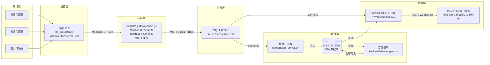

# Industrial-IoT-Edge-Gateway-System

工业物联网边缘网关系统 —— 一个模拟工厂数据采集与边缘计算的全栈项目。

## 项目简介

本项目实现了一套完整的工业物联网（IIoT）数据采集链路：由 Python 模拟 PLC 持续生成电压、电流、功率因数、温度等工业量测数据，Go 编写的边缘网关通过 **Modbus/TCP** 协议轮询读取保持寄存器，进行量纲换算与数据质量校验后，以 **MQTT** 协议上传至消息总线；订阅端将数据落地 **InfluxDB** 时序数据库，Flask 后端提供 REST API 与 WebSocket 实时推送，告警引擎周期性执行阈值检测并将告警写入告警表；React 前端仪表盘展示实时数据卡片、历史趋势图与滚动告警列表。整个系统通过 Docker Compose 一键编排部署。

## 系统架构图



## 技术栈

| 层级 | 技术 | 说明 |
|------|------|------|
| 数据采集 | Go 1.21 + `github.com/goburrow/modbus` | Modbus/TCP 客户端，定时轮询保持寄存器 |
| 消息上报 | Go + `github.com/eclipse/paho.mqtt.golang` | MQTT QoS1 发布，断线自动重连 |
| 设备模拟 | Python 3 + `pymodbus` | 模拟 PLC，开启 Modbus TCP 服务端 |
| 消息总线 | EMQX（或 mosquitto） | MQTT Broker，主题 `factory/line1/#` |
| 时序数据库 | InfluxDB 1.8 | 数据库 `factory_metrics`，保留策略 30 天 |
| 后端服务 | Python Flask + `flask-cors` + `flask-socketio` | REST API + WebSocket 实时推送 |
| 告警引擎 | Python + `influxdb` 客户端 | 阈值检测，告警写入 `alerts` 表 |
| 前端 | React 18 + Chart.js + Socket.IO | 仪表盘、趋势图、告警列表 |
| 部署 | Docker + Docker Compose | 一键启动全部 6 个服务 |

## 目录结构

```
Industrial-IoT-Edge-Gateway-System/
├── gateway/                    # Go 边缘网关
│   ├── main.go                 # 网关主程序（Modbus采集 + MQTT发布）
│   ├── config.yaml             # 网关配置文件
│   └── go.mod                  # Go 模块依赖
├── simulator/                  # 设备模拟
│   └── plc_simulator.py        # 模拟 PLC（Modbus TCP 服务端）
├── database/                   # 数据库
│   └── influxdb_init.iql       # InfluxDB 初始化脚本
├── backend/                    # 后端服务
│   ├── api_server.py           # Flask API + MQTT 订阅 + WebSocket
│   └── alert_engine.py         # 告警引擎
├── frontend/                   # 前端
│   ├── src/
│   │   └── App.js              # React 仪表盘主页面
│   └── package.json            # 前端依赖
├── docker/                     # 部署编排
│   └── docker-compose.yml      # 一键启动整个系统
├── docs/                       # 项目文档
│   ├── 系统设计说明书.md
│   ├── API接口文档.md
│   └── 部署手册.md
├── resume/                     # 项目总结
│   └── 项目总结.md
└── README.md                   # 本文件
```

## 快速部署（Docker 一键启动）

```bash
# 1. 克隆或进入项目根目录
cd Industrial-IoT-Edge-Gateway-System

# 2. 一键启动全部服务（PLC模拟器、网关、MQTT、InfluxDB、后端、前端）
docker compose -f docker/docker-compose.yml up -d --build

# 3. 查看服务状态
docker compose -f docker/docker-compose.yml ps

# 4. 访问前端仪表盘
#    http://localhost:3000
```

## 手动部署（开发调试）

```bash
# 1. 启动模拟 PLC
python simulator/plc_simulator.py

# 2. 启动 Go 网关
cd gateway && go run main.go

# 3. 启动后端 API（含 MQTT 订阅与 WebSocket）
python backend/api_server.py

# 4. 启动告警引擎
python backend/alert_engine.py

# 5. 启动前端
cd frontend && npm install && npm start
```

## 验证方法

- 打开 `http://localhost:3000`，看到电压/电流/功率因数/温度四张实时卡片每秒刷新；
- 历史趋势图出现持续曲线；
- 人为调低电压阈值后，告警列表滚动出现"电压超限"告警。

详细部署步骤见 [docs/部署手册.md](docs/部署手册.md)，接口明细见 [docs/API接口文档.md](docs/API接口文档.md)。

## 许可证

MIT License
