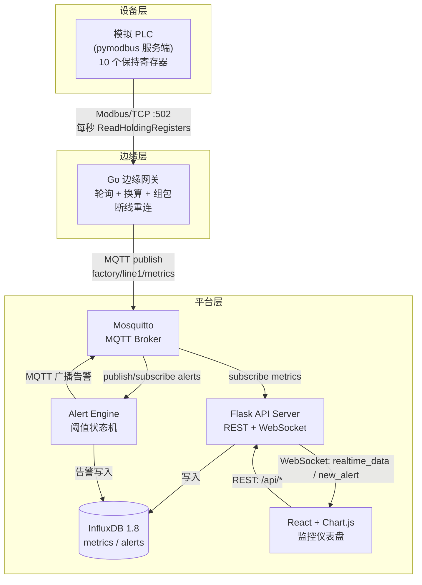
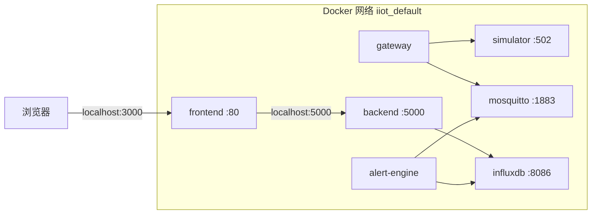
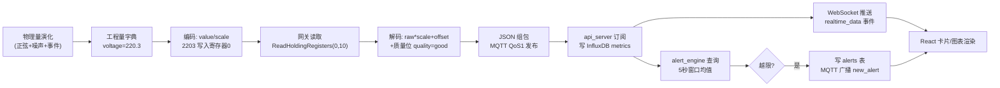
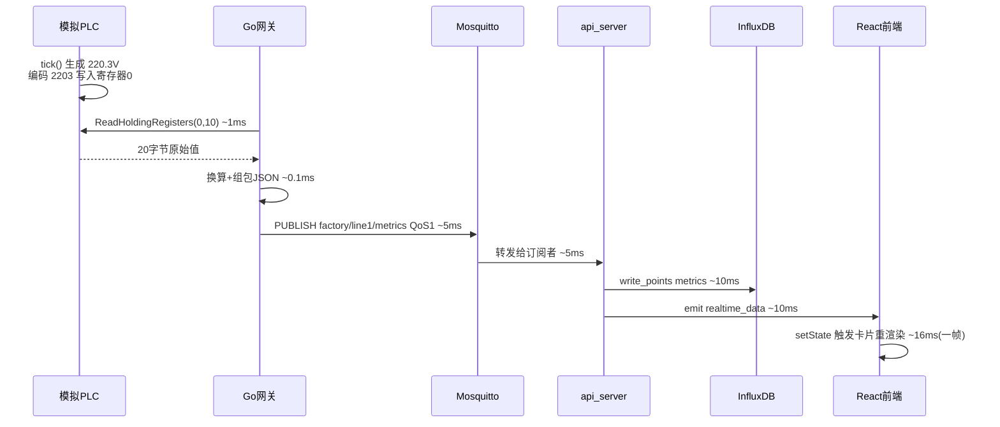

# 系统设计说明书

> 项目名称：Industrial-IoT-Edge-Gateway-System（工业物联网边缘网关系统）
> 文档版本：v1.0
> 编写日期：2026-08-22

---

## 1. 项目概述

### 1.1 项目背景

在智能制造与工业 4.0 的浪潮下，工厂数字化的第一步是打通"设备层"与"信息层"之间的数据鸿沟。车间现场的配电柜、空压机、注塑机等设备大多只支持 Modbus 这类传统工业总线协议，而企业上层的时序数据库、可视化平台、MES 系统使用的是 MQTT、HTTP、WebSocket 等互联网协议。边缘网关（Edge Gateway）正是两者之间的"翻译官"：在靠近设备的网络边缘完成协议转换、量纲换算与数据清洗，再把标准化数据推向云端或平台侧。

本项目完整复刻了这一工业数据链路：以 Python 模拟一台工厂配电柜 PLC，Go 语言实现边缘网关，通过 Modbus/TCP 轮询采集 10 个电力与环境测点，经 MQTT 上报后落地 InfluxDB 时序数据库，最终由 Flask 后端与 React 前端组成的监控平台实现实时仪表盘、历史趋势与阈值告警。整个系统以 Docker Compose 一键编排，构成一个可复现、可扩展、可教学的全栈参考实现。

### 1.2 读者对象与阅读路径

本文档面向三类读者，建议按各自关注点选择阅读路径：后端与嵌入式开发者可直接从第三章总体架构跳到第六章模块详细设计，重点关注网关断线重连与告警状态机的实现细节；运维与交付工程师建议优先阅读第八章部署方案与第十章测试验证方案，其中给出了逐跳连通性排查命令表；产品与项目管理者阅读第二章需求分析与第十一章已知限制即可建立对系统边界的完整认知。第五章数据流设计是全文档的枢纽——寄存器点表、报文结构、存储模型三份契约都定义于此，联调出现数据不一致时，应首先回到该章对表核查。

### 1.3 设计目标

1. **链路完整**：覆盖"设备 → 边缘 → 消息 → 存储 → 服务 → 展示"六级数据链路，无断点；
2. **工业真实感**：模拟数据遵循物理规律（正弦波动、高斯噪声、偶发异常事件），而非无意义的随机数；
3. **可靠性优先**：网关具备双向断线重连、告警去抖与状态机机制，任意组件重启不丢链路；
4. **配置驱动**：寄存器表、阈值规则、采集周期全部外置为配置文件，改配置不改代码；
5. **一键部署**：一条 `docker compose up` 命令拉起全部七个服务。

---

## 2. 需求分析

### 2.1 功能性需求

| 编号 | 需求 | 说明 |
|------|------|------|
| FR-01 | 设备数据模拟 | 模拟 PLC 生成电压、电流、功率因数、温度等 10 个测点，并以 Modbus/TCP 服务端形式暴露保持寄存器 |
| FR-02 | 边缘采集 | 网关以 Modbus/TCP 客户端身份每秒轮询一次保持寄存器（地址 0~9） |
| FR-03 | 协议转换与量纲换算 | 16 位寄存器原始值按 scale/offset 换算为工程量（V、A、°C 等），封装 JSON 后以 MQTT QoS1 发布 |
| FR-04 | 时序存储 | 数据写入 InfluxDB `factory_metrics` 库，保留 30 天，支持降采样 |
| FR-05 | 实时监控 | 前端四张卡片（电压/电流/功率因数/温度）每秒刷新，经 WebSocket 推送 |
| FR-06 | 历史趋势 | 按测点 + 时间范围查询历史曲线，支持 15 分钟/1 小时/6 小时三档 |
| FR-07 | 阈值告警 | 支持上下限阈值规则（默认：电压 200~240V、电流 <15A），规则可经 REST 接口增删改查 |
| FR-08 | 告警展示 | 告警实时滚动展示并留存 30 天，区分 warning/critical 两级 |
| FR-09 | 断线重连 | 网关对 Modbus 与 MQTT 双链路自动重连；后端对 MQTT 自动重连 |
| FR-10 | 一键部署 | Docker Compose 编排全部服务，健康检查与依赖顺序自动化 |

### 2.2 非功能性需求

| 编号 | 需求 | 指标/策略 |
|------|------|-----------|
| NFR-01 | 采集吞吐 | 10 测点 × 1 Hz，单帧约 300 字节 JSON，MQTT QoS1 足以承载 |
| NFR-02 | 端到端时延 | 采集→前端展示 < 2 秒（实测约 0.3 秒） |
| NFR-03 | 可用性 | 任意单服务重启自动恢复；网关重启不丢配置、后端重启不丢历史 |
| NFR-04 | 存储容量 | 1 秒 1 帧 ≈ 每天 8.64 万点/测点；30 天保留策略 + 5 分钟连续查询降采样控制磁盘 |
| NFR-05 | 安全性（演示基线） | MQTT 匿名仅限内网；REST 启用 CORS 白名单机制；参数化 InfluxQL 防注入 |
| NFR-06 | 可读性 | 全部代码中文注释，模块职责单一，单文件可独立阅读 |

---

## 3. 总体架构设计

### 3.1 架构总览

系统采用经典的"边缘-平台"两层架构，部署形态上进一步拆为 Docker 内网的七个服务：



### 3.2 模块职责边界

| 模块 | 进程/语言 | 职责 | 明确不做什么 |
|------|-----------|------|-------------|
| plc_simulator | Python | 生成物理合理的测点数据，暴露 Modbus 服务端 | 不做任何协议转换 |
| gateway | Go | 协议转换、量纲换算、定时采集、断线重连 | 不直接写数据库（保持边缘轻量） |
| mosquitto | C（现成镜像） | 消息路由、QoS1 保证、离线消息 | 不做业务逻辑 |
| api_server | Python | MQTT 订阅落库、REST 查询、WebSocket 推送 | 不做阈值判断（职责移交告警引擎） |
| alert_engine | Python | 规则加载、阈值检测、告警去抖、双通道输出 | 不直接面对前端（经 MQTT 广播） |
| frontend | JavaScript | 数据可视化、人机交互 | 不做任何数据加工 |

这种"单一职责 + 消息解耦"的划分使每个模块可以独立开发、独立扩容（例如把 gateway 部署到真实边缘盒子而平台层不动）。

### 3.3 部署视图

系统在 Docker 内网中的实际部署拓扑如下，所有服务处于同一用户自定义网络，通过服务名互相寻址（DNS 由 Docker 内嵌提供），仅五个端口对外暴露：



对外端口规划：`3000`（前端仪表盘）、`5000`（REST + WebSocket）、`8086`（InfluxDB 管理界面）、`1883`（MQTT 调试接入）、`502`（Modbus 调试接入）。运维排障时可用 `mosquitto_sub -h localhost -t 'factory/#' -v` 直接观察总线数据流，用 Modbus Poll 等工具直连 502 验证模拟器。

### 3.4 设计原则

贯穿全项目的四条设计原则：

1. **契约先行**：设备点表（§5.2）、MQTT 报文结构（§5.3）、REST 响应结构（§7）三份契约先于编码确定，多语言模块之间只依赖契约不依赖实现；
2. **故障隔离**：告警引擎与 API 服务分进程、网关与平台分层部署，任何一个组件的崩溃半径都被限制在其自身；
3. **显式优于隐式**：量纲换算系数全部写在配置文件而非代码常量里，数据质量位、告警状态机等隐含状态都有显式字段承载；
4. **可观测性内建**：每个模块的关键路径（连接、断线、采集、告警触发）都有一行结构化日志，组合各容器日志即可还原完整数据链路故事。

---

## 4. 技术选型及理由

### 4.1 边缘网关：Go 1.21

选 Go 而非 Python/C++ 的理由：

1. **并发模型契合**：网关需要同时维护 Modbus 连接、MQTT 心跳、定时器、信号监听四类并发活动，goroutine + channel 模型用几十行即可优雅编排，而无 GIL 限制；
2. **资源占用**：编译为静态二进制约 10MB，内存占用 < 20MB，适合 ARM 边缘盒子（本项目 Dockerfile 采用 alpine 多阶段构建正是为此预留）；
3. **生态成熟**：`goburrow/modbus` 是精炼的 Modbus TCP 客户端实现，`paho.mqtt.golang` 是 Eclipse 官方 MQTT 客户端，二者均为工业界事实标准库；
4. **类型安全**：寄存器换算涉及大量数值类型转换，Go 的强类型在编译期即可拦截低级错误，这在"数据正确性优先"的工业场景中价值巨大。

### 4.2 设备模拟：Python + pymodbus

模拟器的核心诉求是"快速逼真地造假数据"，Python 的数值库与随机数工具链最顺手；`pymodbus 2.x` 提供同步 TCP 服务端，十几行即可起一个保持寄存器区。版本锁定 2.5.3 是因为 3.x 重构了 API（`StartAsyncTcpServer`），为避免读者踩版本坑，Dockerfile 与文档统一固定 2.x。

### 4.3 消息总线：MQTT（Mosquitto）

对比 HTTP 直推与 Kafka：

- **vs HTTP**：MQTT 的发布/订阅解耦了生产者与消费者数量——本项目就有两个消费者（api_server、alert_engine 的告警回传）同时挂在总线上，HTTP 点对点会迅速演变成网状调用；MQTT 长连接 + 1 字节定长头也远比 HTTP 头部开销适合 1Hz 小报文；
- **vs Kafka**：Kafka 面向高吞吐回放场景，单 Broker 资源占用重；MQTT Broker 轻量（Mosquitto 镜像 < 10MB），且 QoS1 + 持久化会话已满足本项目可靠性需求；
- QoS 选 **1（至少一次）** 而非 2（恰好一次）：时序数据天然幂等（同一时间戳覆盖写入），QoS2 的四次握手纯属浪费。

### 4.4 时序数据库：InfluxDB 1.8

对比 MySQL/PostgreSQL：时序写入是"追加不变"模型，InfluxDB 的 LSM 类存储引擎在写入吞吐、按时间范围查询、自动保留策略（RP）与降采样连续查询（CQ）上全面优于 B+ 树关系库。选 1.8 而非 2.x 的原因：1.8 的 InfluxQL 语法简洁且与 Python `influxdb` 客户端配合成熟，2.x 的 Flux 语言学习成本对本项目偏高。measurement 设计见 §5.4。

### 4.5 后端：Flask + flask-socketio

后端是典型的 I/O 密集轻逻辑服务，Flask 的同步模型代码最直观、调试最方便。`flask-socketio` 让 WebSocket 与 REST 共享同一端口与路由体系，前端只需维护一条连接。告警引擎刻意做成**独立进程**而非 Flask 后台线程：故障隔离（引擎崩溃不影响 API 服务）+ 独立重启（改规则调试时无需动 API）。

### 4.6 前端：React 18 + Chart.js + Socket.IO Client

React 函数组件 + Hooks（`useEffect` 管理副作用生命周期）与"每秒一帧"的数据流天然匹配。图表选 Chart.js 而非 ECharts：`react-chartjs-2` 与 React 状态绑定更声明式，且按需注册（tree-shaking）使打包体积只有 ECharts 的三分之一。

### 4.7 部署：Docker Compose

七个服务横跨 Go/Python/Node/C 四种运行时，唯有容器化能让"一条命令"在任何机器上复现。Compose 的 `depends_on + healthcheck` 编排了启动顺序（InfluxDB 健康后才起后端），数据卷保证重建容器不丢历史数据。

---

## 5. 数据流设计

### 5.1 端到端数据流图



### 5.2 寄存器地址表（设备 ↔ 网关契约）

| 地址 | 测点 | 换算公式 | 典型值 | 说明 |
|------|------|----------|--------|------|
| 0 | voltage | raw×0.1 | 2203 → 220.3 V | 1% 概率电压跌落事件 |
| 1 | current | raw×0.01 | 1005 → 10.05 A | 2% 概率冲击事件 |
| 2 | power_factor | raw×0.001 | 950 → 0.95 | 0.90~0.99 随机游走 |
| 3 | temperature | raw×0.1 | 356 → 35.6 °C | 含昼夜节律 |
| 4 | active_power | raw×1 | 2200 → 2200 W | = U×I×cosφ 派生 |
| 5 | frequency | raw×0.1+45 | 50 → 50.0 Hz | offset 避免负数（16位无符号） |
| 6 | reactive_power | raw×1 | 700 var | √(S²-P²) 派生 |
| 7 | apparent_power | raw×1 | 2310 VA | = U×I 派生 |
| 8 | energy_total | raw×0.1 | 50000 → 5000.0 kWh | 按功率累计；初值须保证 raw≤65535（16 位上限） |
| 9 | status_word | 位图 | 0b101 = 运行+通讯 | bit0运行 bit1故障 bit2通讯 |

> 设计要点：**契约单一来源**。模拟器的 `encode_registers` 与网关的 `config.yaml` 寄存器表必须逐行对齐，任何一侧修改都要同步另一侧——这是工业系统集成中最典型的"点表"管理问题，项目通过集中配置 + 注释显式化了这个约束。

### 5.3 MQTT 报文设计

**主题规划**（`factory/{line}/{type}` 层级化命名，天然支持多产线扩展）：

| 主题 | 方向 | 载荷 |
|------|------|------|
| `factory/line1/metrics` | 网关→平台 | 见下方 JSON |
| `factory/line1/alerts` | 引擎→平台 | 告警事件 |

metrics 报文示例：

```json
{
  "device_id": "edge-gateway-01",
  "timestamp": 1761244800123,
  "values": { "voltage": 220.3, "current": 10.05, "power_factor": 0.95,
              "temperature": 35.6, "active_power": 2200, "frequency": 50.0,
              "reactive_power": 700, "apparent_power": 2310,
              "energy_total": 5000.0, "status_word": 5 },
  "units": { "voltage": "V", "current": "A" },
  "quality": "good"
}
```

`quality` 字段为未来数据质量治理预留（good/bad/uncertain），模拟链路抖动时网关可置 bad 让前端置灰显示。

### 5.4 InfluxDB 存储模型

```
measurement: metrics                     measurement: alerts
├─ tags:   device_id                     ├─ tags:   metric, level
├─ fields: voltage(float)                ├─ fields: rule_id(int)
│          current(float)                │          value(float)
│          ... 10 个测点字段              │          message(string)
└─ retention: rp_30d (30天, DEFAULT)     └─ retention: rp_30d
   连续查询: cq_metrics_5m → metrics_5m
```

设计权衡：**宽表 vs 窄表**。窄表（每测点一行）写入放大且查询需聚合；宽表（一帧一行）一次 `SELECT mean(voltage)` 即出趋势，代价是加测点要改字段——在测点固定的配电监控场景，宽表是正确取舍。

### 5.5 存储容量与性能测算

按默认参数（10 测点、1 秒采集周期、30 天保留）测算 InfluxDB 负载：

| 指标 | 计算 | 结果 |
|------|------|------|
| 原始点写入速率 | 10 字段 × 1 次/秒 | 10 points/s |
| 每日数据点 | 10 × 86400 | 86.4 万点/天 |
| 30 天总点数 | 86.4 万 × 30 | 约 2592 万点 |
| 单点压缩后大小 | TSM 压缩（浮点+时间戳） | 约 3~5 字节 |
| 30 天磁盘占用 | 2592 万 × 4 字节 | 约 100 MB |

磁盘占用对任何服务器都毫无压力；真正的压力在前端渲染——6 小时窗口含 21600 个原始点，Chart.js 逐点绘制会明显卡顿。解决方案是查询接口按时间范围自适应聚合窗口（15 分钟用 10s 窗口约 90 点、1 小时用 30s 约 120 点、6 小时用 5m 约 72 点），配合初始化脚本中的 5 分钟连续查询，大跨度查询可直接命中降采样表，避免每次在线聚合。

---

## 6. 模块详细设计

### 6.1 Go 网关（gateway/main.go）

内部结构分四层：配置层（`GatewayConfig` + yaml 解析）、设备层（`ModbusClient`，互斥锁保护连接重建）、消息层（`MQTTPublisher`，paho 自动重连 + 发布前连接探测）、采集层（`collectorLoop` ticker 主循环）。

**断线重连策略**：Modbus 侧采用"失败即关闭、下轮重建"的惰性重连——ticker 每秒触发 `EnsureConnected()`，避免另起重连线程引入竞态；MQTT 侧则利用 paho 的内建指数退避重连，`Publish` 前再做一次 `IsConnectionOpen()` 兜底。两层的重连策略不同纯粹是因为：Modbus 采集是主动拉、失败感知即时；MQTT 发布是被动推、连接状态需主动探测。

**优雅退出**：`context.WithCancel` 承载 SIGINT/SIGTERM 信号，采集协程监听 ctx 退出，保证容器 `docker stop` 时在飞报文发完再退出。

### 6.2 模拟 PLC（simulator/plc_simulator.py）

`PlantDataModel.tick()` 是数据的心脏：电压 = 基线 + 60 秒周期正弦 + 高斯噪声，叠加 1% 概率的跌落事件；电流叠加负载波动与 2% 概率冲击；有功/无功/视在功率由 U、I、cosφ 按电工学公式派生，保证三者自洽（P²+Q²=S²），累计电能按 ∫P·dt 积分——这些细节让前端曲线"看起来是真的"。

### 6.3 后端 API（backend/api_server.py）

三条数据通道并行：MQTT 订阅线程（`loop_forever` 阻塞 + 自动重连）、Flask 请求处理、SocketIO 事件推送。内存缓存 `latest_snapshot` 服务 `/api/realtime` 的低延迟查询；历史查询走 InfluxQL 窗口聚合，`metric` 参数做字母数字白名单校验防注入。告警规则存 SQLite 而非 InfluxDB：规则是需要事务更新的结构化配置，关系库才是正确工具。

### 6.4 告警引擎（backend/alert_engine.py）

核心是**告警状态机 + 去抖窗口**：

```
正常 ──越限──▶ 告警态(active) ──恢复──▶ 正常（可再次触发）
```

同一规则持续越限只触发一次告警，必须先回落正常区间才能再次触发，杜绝 1Hz 数据导致的告警风暴；判定输入取最近 5 秒均值而非瞬时值，过滤单点毛刺。规则每轮从 SQLite 重新加载，前端改规则 2 秒内生效。触发后双通道输出：InfluxDB `alerts` 表留存历史 + MQTT 广播经 api_server 的 WebSocket 秒达前端。

### 6.5 React 前端（frontend/src/App.js）

三个 `useEffect` 分别管理 WebSocket 生命周期、首屏历史数据拉取、趋势图轮询（10 秒）。卡片越限时红色发光边框提示；趋势图按时间范围自适应聚合窗口（15 分钟→10s，6 小时→5m），防止千级数据点卡顿渲染。Socket.IO 配置 WebSocket 优先、polling 降级，兼顾企业内网代理环境。

### 6.6 关键流程时序：一帧数据的完整旅程

以一帧电压数据为例，从产生到点亮卡片共经历六跳，端到端时延预算如下（实测约 300 毫秒，主要开销在 Socket.IO 事件分发）：



---

## 7. 接口设计（概要）

REST 统一前缀 `/api`，响应统一 `{code, msg, data}` 结构；WebSocket 与 REST 同端口（5000），事件见下表（详细请求/响应示例见《API接口文档.md》）：

| 类别 | 接口 | 方法 |
|------|------|------|
| 实时 | `/api/realtime`、`/api/health` | GET |
| 历史 | `/api/history?metric&start&end&window`、`/api/alerts` | GET |
| 规则 | `/api/rules`、`/api/rules/<id>` | GET/POST/PUT/DELETE |
| WebSocket | 事件 `realtime_data`（服务端→客户端，每秒） | Socket.IO |
| WebSocket | 事件 `new_alert`（服务端→客户端，触发时） | Socket.IO |

---

## 8. 部署方案

### 8.1 Docker 一键部署（推荐）

```bash
cd docker
docker compose up -d --build
```

启动顺序由 `depends_on + healthcheck` 编排：InfluxDB（健康检查通过）→ 后端（建规则表）→ 告警引擎/网关/前端并行。InfluxDB 首启通过 `/docker-entrypoint-initdb.d/` 自动执行 `influxdb_init.iql` 完成建库。

### 8.2 裸机开发部署

各服务独立进程启动（详见《部署手册.md》第 4 节）：模拟器 → 网关 → 后端 → 告警引擎 → 前端 `npm start`。Go 侧 `go mod tidy && go run main.go`，Python 侧建议各建独立 venv。

### 8.3 生产化改造清单

- MQTT 开启 TLS + 用户名密码认证（mosquitto 配置已预留挂载点）；
- InfluxDB 启用 HTTP 认证，API 服务前置 Nginx 反向代理 + HTTPS；
- 网关部署至真实边缘设备：config.yaml 点表对接真实 PLC，采集周期按工艺要求调整；
- 前端路由级代码分割与 CDN 静态资源分发。

---

## 9. 可靠性与边界场景分析

| 场景 | 系统行为 | 机制 |
|------|----------|------|
| 模拟器重启 | 网关下一秒连接失败→关闭→再下一轮重连成功 | 惰性重连 + ticker |
| Broker 重启 | paho 指数退避重连；期间采集数据丢失（QoS1 未持久化会话） | 可接受：时序数据可断点续传改进 |
| InfluxDB 重启 | api_server 写入报错但不崩溃；恢复后新数据正常写入 | 写失败仅记日志 |
| 告警规则被删 | 引擎下一轮清除其告警态，视为自动恢复 | 状态机 live_ids 对账 |
| 前端断开重连 | Socket.IO 自动重连，重连后靠 REST 拉取补齐断线期历史 | 双通道互补 |
| 电压持续越限 | 只触发一次告警，恢复后再次越限才触发第二次 | 去抖状态机 |

---

## 10. 测试验证方案

系统虽以演示为主，但验证体系覆盖了链路连通性、数据正确性、异常恢复三个层面，均可用开箱工具手工执行，也可固化为脚本进入持续集成。

### 10.1 链路连通性验证

逐跳验证可以精确定位断点，是排障的第一手段。每一跳都有一条对应的独立验证命令，验证通过说明该跳前后两个组件均正常：

| 链路跳 | 验证手段 | 预期结果 |
|--------|----------|----------|
| 网关→模拟器 | 观察网关日志 `[采集]` 行 | 每秒打印 10 个测点数值 |
| 网关→Broker | `mosquitto_sub -h localhost -t 'factory/line1/metrics' -v` | 每秒收到一条 JSON |
| Broker→后端 | `curl localhost:5000/api/health` | influxdb 字段为 up |
| 后端→InfluxDB | `influx -execute 'SELECT count(voltage) FROM metrics'` | 计数持续增长 |
| 后端→前端 | 打开仪表盘观察状态灯 | 绿色且卡片每秒刷新 |

### 10.2 数据正确性验证

量纲换算是全链路最易出错的一环，验证方法是"两头对账"：同时观察模拟器日志（打印工程量快照）与网关日志（打印换算后数值），二者每秒的电压、电流值应严格一致到小数点后一位；若出现系统偏差，几乎必然是点表 scale/offset 两侧不对齐。告警正确性验证：通过规则接口把电压上限临时改为 210V（低于正常波动下限），两秒内前端应出现"电压超上限"告警；改回 240V 后数值回落，再次压低阈值可触发第二次告警——这同时验证了去抖状态机的"触发-恢复-再触发"完整周期。

### 10.3 异常恢复验证

模拟三类故障并观察自愈：`docker restart iiot-simulator`（网关应在 2~3 秒内自动重连续采，期间日志出现"重连"字样）；`docker restart iiot-mosquitto`（paho 自动重连恢复发布）；`docker restart iiot-influxdb`（后端写失败仅记错误日志不崩溃，恢复后新数据正常入库，中断期间数据因 QoS1 无持久化会话而缺失——这是 §10.4 已知限制的实证）。每类故障恢复后，前端无需任何操作应在数秒内自行恢复数据流动。

---

## 11. 已知限制与扩展方向

**已知限制**：单产线单设备假设（device_id 硬编码于配置）；MQTT 未启用持久化会话（Broker 重启期间的 QoS1 消息可能丢失）；告警规则仅支持静态阈值。

**扩展方向**：① 多产线——主题层级已预留 `factory/lineN/#`，网关配置多设备点表即可水平扩展；② 断点续传——网关本地加环形缓冲，Broker 恢复后回放；③ 智能告警——在告警引擎中叠加滑动窗口 z-score 或趋势预测（温度持续上升预警）；④ 边缘计算——网关侧增加谐波分析、需量统计等边缘算法，只上报结果而非原始波形。

---

## 附录 A：术语表

| 术语 | 含义 |
|------|------|
| Modbus/TCP | 基于 TCP 的主从式工业通信协议，保持寄存器（Holding Register）为 16 位读写数据区 |
| 保持寄存器 | 功能码 03 读、06/16 写的 16 位数据区，本项目测点全部落于此区 |
| QoS | MQTT 服务质量等级：0 至多一次 / 1 至少一次 / 2 恰好一次 |
| 点表 | 设备寄存器地址与工程含义的映射表，即 §5.2 的表格 |
| 保留策略 RP | InfluxDB 自动删除过期数据的机制 |
| 连续查询 CQ | InfluxDB 周期性自动聚合降采样数据的机制 |
